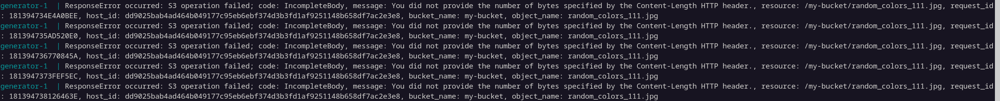

# cot-3

I guess you know how to run docker compose. Nevertheless all you need to do is to write `docker compose up`.

There will be 2 containers: minio and cot-3-generator-1 and 1 volume.

After the allocated memory runs out, the server starts blocking file uploads. In the Python client this is accompanied by the following errors:

100 MB of allocated memory

